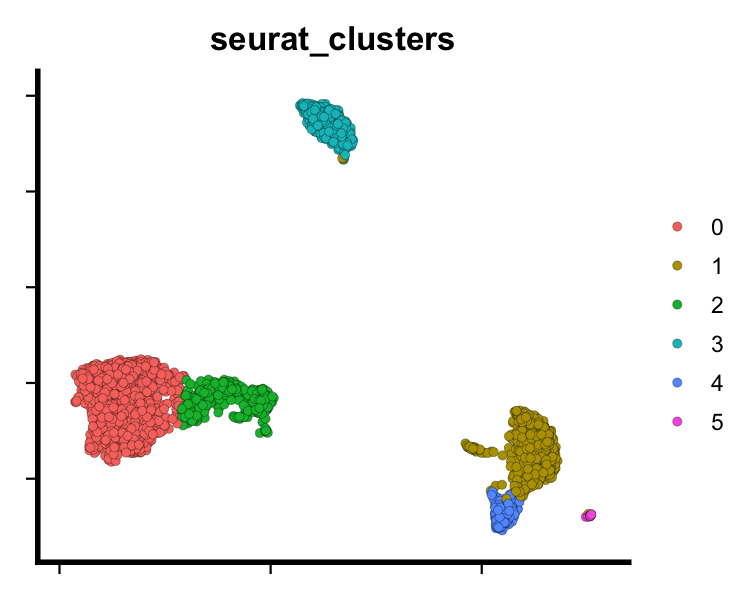
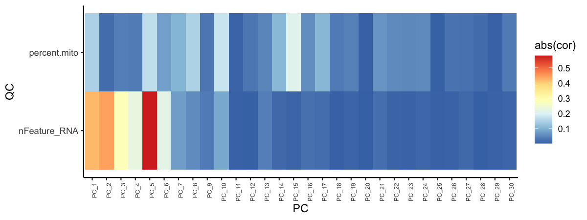
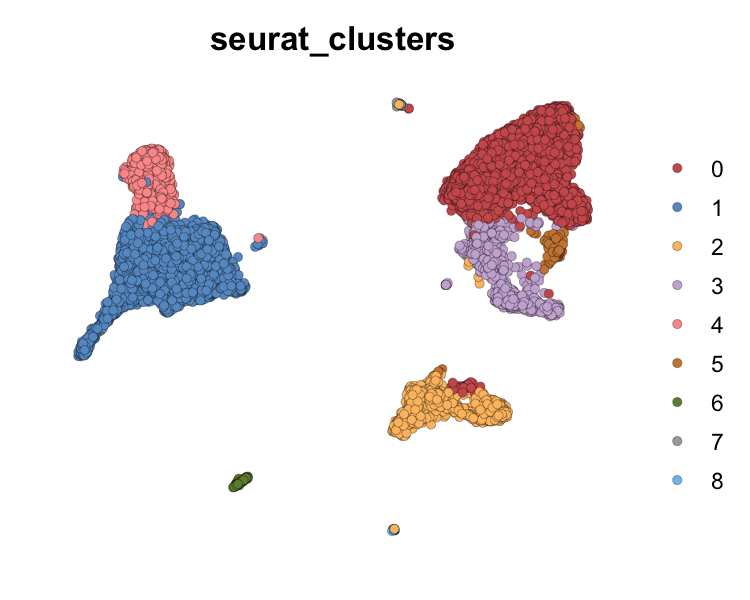
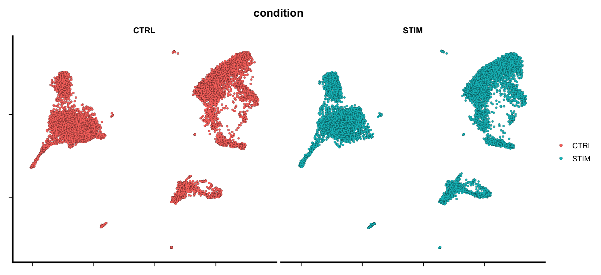

<!-- output: -->
<!--   html_document: -->
<!--     highlight: kate -->
<!--     toc: yes -->
<!--     toc_float: yes -->
<!--     toc_depth: 4 -->
<!--     code_folding: none -->
<!--     theme: cosmo -->
<!--     df_print: paged -->
<!--     keep_md: TRUE -->
<!--     code_download: TRUE -->
<!--   html_notebook: -->
<!--     highlight: kate -->
<!--     toc: yes -->
<!--     toc_float: yes -->
<!--     toc_depth: 4 -->
<!--     code_folding: none -->
<!--     theme: cosmo -->
<!--     df_print: paged -->
<!-- editor_options:  -->
<!--   chunk_output_type: inline -->


# Introduction
The aim of the `SeuratPipe` package is to streamline and provide a __reproducible__ computational analysis pipeline for single cell genomics. It aims to remove technical details from the user, enabling wet lab researchers to have an 'initial look' at the data themselves. 

The package is publicly available on Github [https://github.com/andreaskapou/SeuratPipe](https://github.com/andreaskapou/SeuratPipe).

In this vignette we will show how to perform different Seurat analyses using `SeuratPipe`. To run the contents of this vignette you should download the data from this __Github repository__ [https://github.com/andreaskapou/SeuratPipe_tutorial](https://github.com/andreaskapou/SeuratPipe_tutorial) in the `data` folder.

# SeuratPipe installation

```r
# install.packages("remotes")

# To install the stable release
remotes::install_github("andreaskapou/SeuratPipe@release/v1.0.0")

# To install the latest source version (not recommended)
remotes::install_github("andreaskapou/SeuratPipe")
```

## Scrublet Python installation
Scrublet is a method for doublet detection, Github page: [https://github.com/swolock/scrublet](https://github.com/swolock/scrublet). 

The method is implemented in Python, hence when installing `SeuratPipe`, the Scrublet package cannot be installed automatically. We can try to install and run Scrublet within R using the `reticulate` package. I wrote a helper function to ease installation of Scrublet. In R type:

```r
SeuratPipe::install_scrublet()
# type ?install_scrublet for more details
```

If this fails, you need to follow details in `reticulate` package on how to install any Python package on your machine. If you have any issues with installation, you can still use the SeuratPipe package, although you have to set `use_scrublet = FALSE`, i.e. do not perform any doublet detection in your analysis.

# Datasets
Initially, using the __PBMC3K__ dataset, we will show how to read 10x output files and create Seurat objects, perform QC filtering and subsequent processing and clustering steps. 

Next, we will use the __IFNB__ dataset, which contains two samples (control and stimulated cells) to perform data integration with __Harmony__.

First we load required packages

```r
library(Seurat)
library(SeuratPipe)
```

# Running QC pipeline

`SeuratPipe` assumes the user will have a __sample metadata__ file/data frame which contains all the metadata for each scRNA-seq sample. It also requires the following column names to be present: `sample`, `donor`, `path`, `condition` and `pass_qc` (logical `TRUE` or `FALSE`).

For instance the below metadata file looks like this:

|sample |donor |path   |condition |pass_qc |technology |
|:------|:-----|:------|:---------|:-------|:----------|
|pbmc1  |pbmc1 |pbmc3k |Healthy   |TRUE    |whole-cell |

Settings for QC

```r
# Assume 10x data are in 'data' and we have metadata file 'meta_pbmc3k.csv'
io <- list()
io$data_dir <- "data/"
io$out_dir <- "pbmc_results/qc/"
io$tenx_dir <- "/outs/" # Assume whole-cell RNA-seq
io$meta_file <- paste0(io$data_dir, "/meta_pbmc3k.csv")

# Opts
opts <- list()
opts$nfeat_thresh <- 200
opts$mito_thresh <- 5
opts$meta_colnames <- c("donor", "condition", "pass_qc")
opts$qc_to_plot <- c("nFeature_RNA", "percent.mito")
```

We can perform all QC pipeline steps using a single wrapper function `run_qc_pipeline` as shown below. This function will also generate all the QC plots. 

__NOTE__: The wrapper will also store an `.rds` file, named (`seu_qc.rds`) which contains the Seurat object and the `opts` we defined for our analysis. This is done for reproducibility purposes (see `Cluster analysis` section how to read this file).


```r
# Run pipeline, note you can define additional parameters
# type ?run_qc_pipeline for help.
seu <- run_qc_pipeline(
  data_dir = io$data_dir, 
  sample_meta = NULL, 
  sample_meta_filename = io$meta_file,
  nfeat_thresh = opts$nfeat_thresh, 
  mito_thresh = opts$mito_thresh,
  meta_colnames = opts$meta_colnames,
  out_dir = io$out_dir,
  qc_to_plot = opts$qc_to_plot,
  use_scrublet = FALSE, 
  use_soupx = FALSE, 
  tenx_dir = io$tenx_dir)
```

```
## [1] "Sample  pbmc1 ... \n"
```

A template for running QC pipeline using `SeuratPipe` can be found here: [https://github.com/andreaskapou/SeuratPipe_tutorial/blob/main/template_qc_pipeline.R](https://github.com/andreaskapou/SeuratPipe_tutorial/blob/main/template_qc_pipeline.R) 

## Advanced
If you want more control over QC analysis, the above function wraps the following commands and generates plots. 

```r
# First create Seurat
seu <- create_seurat_object(...)
# Then perform filtering
seu <- filter_seurat_object(...)
```


# Running cluster pipeline
It is __advised__ to have different files for different analysis tasks, here QC and clustering. Because, most likely you will perform QC once (or two), but clustering (and other downstream tasks) multiple times. This is the reason we store the QCed Seurat object so we can read it directly from the disk. 


```r
# Define again I/O and opts settings
io <- list()
io$base_dir <- "pbmc_results/"
io$out_dir <- paste0(io$base_dir, "/cluster/")
# Read Seurat object stored after QC
seu_obj <- readRDS(file = paste0(io$base_dir, "/qc/seu_qc.rds"))
seu <- seu_obj$seu   # Extract Seurat object
opts <- seu_obj$opts # Extract opts from QC (for reproducibility)

# Clustering opts

# Number of PCs, can be a vector: c(30, 50)
opts$npcs <- c(30)
# PCs to perform UMAP and clustering, e.g c(30, 40)
opts$ndims <- c(25)
# Clustering resolutions
opts$res <- seq(from = 0.2, to = 0.2, by = 0.1)
# QC information to plot
opts$qc_to_plot <- c("nFeature_RNA", "percent.mito")
# Metadata columns to plot
opts$meta_to_plot <- c("condition", "sample")
# Maximum cutoff values for plotting continuous features
opts$max.cutoff <- "q98"
```

In `SeuratPipe` we can also define module groups, consisting of known marker genes, that can help in potentially annotating cell populations.

```r
# Define modules for lineage and cell cycle
lineage <- list(lin_CD4 = c("IL7R", "CCR7"),
                lin_Monocyte = c("CD14", "LYZ", "FCGR3A"),
                lin_NK = c("GNLY", "NKG7"))
# Take a random subset from Seurat's cycle genes
cell_cycle <- list(cc_s = c("PCNA", "RRM1", "POLA1", "USP1"),
                   cc_g2m = c("HMGB2", "MKI67", "TMPO", "CTCF"))

# Group all modules in named list to pass to SeuratPipe functions
opts$modules_group <- list(lineage = lineage,
                           cell_cycle = cell_cycle)
```

Here we show how to perform the most common analysis pipeline in Seurat for cell type identification. 
The wrapper function performs the following steps: 

1. Data processing, e.g. Log normalisation and scaling.
2. Running PCA. 
3. Perform UMAP and clustering. 
4. Generate plots / outputs in corresponding directories.

__NOTE__: If multiple `npcs` and `ndims` are given as input, the updated Seurat object with the last setting will be returned. 

```r
# Run pipeline, note you can define additional parameters
# type ?run_cluster_pipeline for help.
seu <- run_cluster_pipeline(
  seu_obj = seu, 
  out_dir = io$out_dir, 
  npcs = opts$npcs,
  ndims = opts$ndims, 
  res = opts$res,
  modules_group = opts$modules_group,
  metadata_to_plot = opts$meta_to_plot,
  qc_to_plot = opts$qc_to_plot, 
  max.cutoff = opts$max.cutoff,
  pcs_to_remove = NULL, seed = 1)
```

```
## Res 0.2 
## Modularity Optimizer version 1.3.0 by Ludo Waltman and Nees Jan van Eck
## 
## Number of nodes: 2642
## Number of edges: 127025
## 
## Running Louvain algorithm...
## Maximum modularity in 10 random starts: 0.9328
## Number of communities: 6
## Elapsed time: 0 seconds
```

A template for running clustering pipeline using `SeuratPipe` can be found here: [https://github.com/andreaskapou/SeuratPipe_tutorial/blob/main/template_cluster_pipeline.R](https://github.com/andreaskapou/SeuratPipe_tutorial/blob/main/template_cluster_pipeline.R) 

## Advanced
If you want more control over the clustering pipeline, the above function wraps the following functions. The code below works for a single choice of `npcs` and `ndims` whereas the wrapper function allows multiple values to be passed as a vector.

```r
# Process and PCA
seu <- lognormalize_and_pca(...)
# UMAP
seu <- run_umap(...)
# QC plots on dimensional reduced space
dimred_qc_plots(...)
# Module score analysis
seu <- module_score_analysis(...)
# Clustering
seu <- cluster_analysis(...)
```

Users can have even more control over `cluster_analysis`, and the main functions to perform clustering are the following:

```r
# Find neighbors
seu <- find_neighbors(...)
# Clustering with specific resolution
seu <- find_clusters(...)
# Identify marker genes
markers <- find_all_markers(...)
```

Note that the __naming convention__ is to use exactly the same function names as Seurat package, but using underscores instead of __CamelCase__, which is the default in Seurat. The same holds for the plotting functions (see examples in next section).

In case we had a `list` of Seurat objects and wanted to perform clustering analysis for each sample independently, the code would look something like this:

```r
for (s in names(seu)) {
  sample_dir <- paste0(io$out_dir, "/", s, "/")
  seu[[s]] <- run_cluster_pipeline(...)
}
```

## Plotting / Visualisation
`SeuratPipe` also provides tailored functions to generate high quality plots, by adapting Seurat's built in plotting functions.


```r
# UMAP plot
dim_plot(seu, reduction = "umap", group.by = "seurat_clusters", pt.size = 2)
```




```r
# UMAP plot using SeuratPipe colour palette
dim_plot(seu, reduction = "umap", group.by = "seurat_clusters", 
         col_pal = SeuratPipe:::discrete_col_pal, pt.size = 2)
```


```r
# Plotting specific genes
feature_plot(seu, features = c("LYZ", "NKG7"), 
             ncol = 2, legend.position = "top")
```


```r
# Plotting lineage module scores as feature plot
feature_plot(seu, features = names(lineage), ncol = 3) & NoAxes()
```


```r
# Plotting lineage module scores as dot plot
dot_plot(seu, features = names(lineage))
```


We can also check if specific technical factors are correlated with specific principal components.

```r
pca_feature_cor_plot(seu, features = c("nFeature_RNA", "percent.mito"))
```



The above plot can also be useful to understand which specific principal components explain/capture information about different cell types/lineages.

```r
# Correlation of lineage scores with PCs
pca_feature_cor_plot(seu, features = names(lineage))
```


# Harmony integration
To showcase the pipeline for Harmony integration we will first load a pre-processed Seurat immune dataset called `ifnb`. The object is in the same format as if we were to run QC with the code in `run_qc_pipeline`.


## Reading Seurat object and defining settings for Harmony pipeline. 
Note that parameters are almost identical to `run_cluster_pipeline`, with minor differences, such as the `run_harmony_pipeline` can accept a list of Seurat objects (i.e. multiple samples), and internally processes and merges the data. If you already have merged and processed your data, the pipeline accepts a single Seurat object and will skip the merging step.

```r
# I/O
io <- list()
io$base_dir <- "ifnb_results/"
io$out_dir <- paste0(io$base_dir, "/integrate/")
# Read QCed Seurat object
seu_obj <- readRDS(file = paste0(io$base_dir, "/qc/seu_qc.rds"))
seu <- seu_obj$seu   # Extract (list of) Seurat objects
opts <- seu_obj$opts # Extract opts from QC (here empty list)

# Clustering opts

# Number of PCs
opts$npcs <- c(50)
# Harmony dims for UMAP and clustering
opts$ndims <- c(40)
# Clustering resolutions
opts$res <- seq(0.1, 0.1, by = 0.1)
# Batch ID to perform integration
opts$batch_id <- "sample"
# QC information to plot
opts$qc_to_plot <- c("nFeature_RNA", "percent.mito")
# Metadata columns to plot
opts$meta_to_plot <- c("condition")
# Maximum number of Harmony iterations
opts$max.iter.harmony <- 50
```

Next we are ready to perform the full Harmony integration pipeline and obtain our final clusters. 

```r
# Run pipeline, note you can define additional parameters
# type ?run_harmony_pipeline for help.
seu <- run_harmony_pipeline(
  seu_obj = seu, 
  batch_id = opts$batch_id,
  out_dir = io$out_dir, 
  npcs = opts$npcs,
  ndims = opts$ndims, 
  res = opts$res, modules_group = NULL, 
  metadata_to_plot = opts$meta_to_plot,
  max.iter.harmony = opts$max.iter.harmony,
  qc_to_plot = opts$qc_to_plot, 
  plot_cluster_markers = FALSE, seed = 1)
```

```
## Res 0.1 
## Modularity Optimizer version 1.3.0 by Ludo Waltman and Nees Jan van Eck
## 
## Number of nodes: 13999
## Number of edges: 548086
## 
## Running Louvain algorithm...
## Maximum modularity in 10 random starts: 0.9674
## Number of communities: 9
## Elapsed time: 1 seconds
```

A template for running Harmony integration pipeline using `SeuratPipe` can be found here: [https://github.com/andreaskapou/SeuratPipe_tutorial/blob/main/template_harmony_pipeline.R](https://github.com/andreaskapou/SeuratPipe_tutorial/blob/main/template_harmony_pipeline.R) 

## Advanced
If you want more control over the Harmony integration pipeline, the above function wraps the following functions. The code below works for a single choice of `npcs` and `ndims` whereas the wrapper function allows multiple values to be passed as a vector.

```r
# Harmony analysis
seu <- harmony_analysis(...)
# UMAP
seu <- run_umap(...)
# QC plots on dimensional reduced space
dimred_qc_plots(...)
# Module score analysis
seu <- module_score_analysis(...)
# Clustering
seu <- cluster_analysis(...)
```

## Visualistion

```r
dim_plot(seu, group.by = "seurat_clusters", pt.size = 2,
         col_pal = SeuratPipe:::discrete_col_pal) & NoAxes()
```




```r
dim_plot(seu, group.by = "condition", split.by = "condition", ncol = 2)
```




```r
# Plotting specific genes
feature_plot(seu, features = c("LYZ", "NKG7"), 
             ncol = 2, legend.position = "top")
```


# Session Info
This vignette was compiled using the following packages:

```r
sessionInfo()
```

```
## R version 4.2.0 (2022-04-22)
## Platform: x86_64-apple-darwin17.0 (64-bit)
## Running under: macOS Big Sur/Monterey 10.16
## 
## Matrix products: default
## BLAS:   /Library/Frameworks/R.framework/Versions/4.2/Resources/lib/libRblas.0.dylib
## LAPACK: /Library/Frameworks/R.framework/Versions/4.2/Resources/lib/libRlapack.dylib
## 
## locale:
## [1] en_GB.UTF-8/en_GB.UTF-8/en_GB.UTF-8/C/en_GB.UTF-8/en_GB.UTF-8
## 
## attached base packages:
## [1] stats     graphics  grDevices utils     datasets  methods   base     
## 
## other attached packages:
## [1] SeuratPipe_1.0.0   sp_1.4-7           SeuratObject_4.1.0 Seurat_4.1.1      
## [5] BiocStyle_2.24.0  
## 
## loaded via a namespace (and not attached):
##   [1] Rtsne_0.16            colorspace_2.0-3      deldir_1.0-6         
##   [4] ellipsis_0.3.2        ggridges_0.5.3        spatstat.data_2.2-0  
##   [7] farver_2.1.0          leiden_0.4.2          listenv_0.8.0        
##  [10] ggrepel_0.9.1         RSpectra_0.16-1       fansi_1.0.3          
##  [13] codetools_0.2-18      splines_4.2.0         knitr_1.39           
##  [16] polyclip_1.10-0       jsonlite_1.8.0        ica_1.0-2            
##  [19] cluster_2.1.3         png_0.1-7             rgeos_0.5-9          
##  [22] pheatmap_1.0.12       uwot_0.1.11           shiny_1.7.1          
##  [25] sctransform_0.3.3     spatstat.sparse_2.1-1 BiocManager_1.30.18  
##  [28] compiler_4.2.0        httr_1.4.3            assertthat_0.2.1     
##  [31] Matrix_1.4-1          fastmap_1.1.0         lazyeval_0.2.2       
##  [34] limma_3.52.1          cli_3.3.0             later_1.3.0          
##  [37] htmltools_0.5.2       tools_4.2.0           igraph_1.3.1         
##  [40] gtable_0.3.0          glue_1.6.2            RANN_2.6.1           
##  [43] reshape2_1.4.4        dplyr_1.0.9           Rcpp_1.0.8.3         
##  [46] scattermore_0.8       vctrs_0.4.1           nlme_3.1-157         
##  [49] progressr_0.10.0      lmtest_0.9-40         spatstat.random_2.2-0
##  [52] xfun_0.31             stringr_1.4.0         globals_0.15.0       
##  [55] mime_0.12             miniUI_0.1.1.1        lifecycle_1.0.1      
##  [58] irlba_2.3.5           gtools_3.9.2          goftest_1.2-3        
##  [61] future_1.25.0         MASS_7.3-57           zoo_1.8-10           
##  [64] scales_1.2.0          spatstat.core_2.4-4   promises_1.2.0.1     
##  [67] spatstat.utils_2.3-1  parallel_4.2.0        RColorBrewer_1.1-3   
##  [70] yaml_2.3.5            reticulate_1.25       pbapply_1.5-0        
##  [73] gridExtra_2.3         ggplot2_3.3.6         rpart_4.1.16         
##  [76] stringi_1.7.6         highr_0.9             harmony_0.1.0        
##  [79] rlang_1.0.2           pkgconfig_2.0.3       matrixStats_0.62.0   
##  [82] evaluate_0.15         lattice_0.20-45       ROCR_1.0-11          
##  [85] purrr_0.3.4           tensor_1.5            labeling_0.4.2       
##  [88] patchwork_1.1.1       htmlwidgets_1.5.4     cowplot_1.1.1        
##  [91] tidyselect_1.1.2      parallelly_1.31.1     RcppAnnoy_0.0.19     
##  [94] plyr_1.8.7            magrittr_2.0.3        R6_2.5.1             
##  [97] generics_0.1.2        DBI_1.1.2             withr_2.5.0          
## [100] mgcv_1.8-40           pillar_1.7.0          fitdistrplus_1.1-8   
## [103] survival_3.3-1        abind_1.4-5           tibble_3.1.7         
## [106] future.apply_1.9.0    crayon_1.5.1          KernSmooth_2.23-20   
## [109] utf8_1.2.2            spatstat.geom_2.4-0   plotly_4.10.0        
## [112] rmarkdown_2.14        viridis_0.6.2         grid_4.2.0           
## [115] data.table_1.14.2     digest_0.6.29         xtable_1.8-4         
## [118] tidyr_1.2.0           httpuv_1.6.5          munsell_0.5.0        
## [121] viridisLite_0.4.0
```

# Acknowledgments
I would like to thank John Wilson-Kanamori, Jordan Portman and Nick Younger. The `SeuratPipe` package has adapted many of the analyses pipelines that were developed by the computational biology group in Neil Henderson's lab at the University of Edinburgh.

This package was supported by funding from the University of Edinburgh and Medical Research Council (core grant to the MRC Institute of Genetics and Cancer) for the Cross-Disciplinary Fellowship (XDF) programme.
